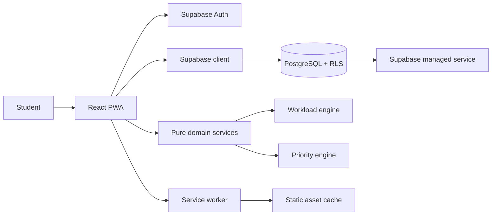
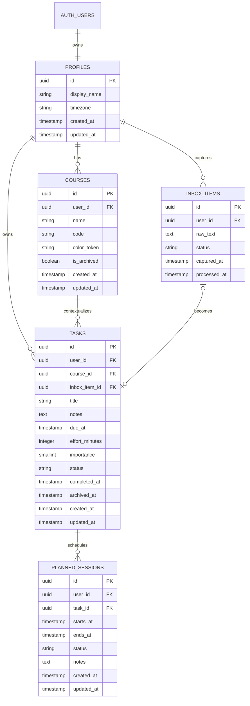

# NEXUS Pre-Development Architecture & UX Review

**Status:** Baseline untuk implementasi MVP  
**Tanggal:** 2026-08-28  
**Scope:** Produk student-first, online-first PWA, free-first

## 1. Keputusan Produk

NEXUS membantu mahasiswa mengubah informasi akademik yang tersebar menjadi workload yang dapat dipahami dan tindakan berikutnya. MVP mengoptimalkan loop berikut:

`Capture -> Contextualize -> Understand -> Decide -> Plan -> Act -> Review`

Prinsip yang mengikat keputusan teknis dan UX:

- **Today adalah anchor utama:** pengguna langsung melihat apa yang perlu diperhatikan sekarang.
- **Capture cepat, konteks belakangan:** quick capture hanya meminta teks; metadata diisi saat contextualization.
- **Deadline dan planned session berbeda:** deadline adalah komitmen eksternal, session adalah niat kerja pengguna.
- **Workload berbasis effort:** durasi kerja lebih bermakna daripada jumlah task.
- **Saran selalu dapat dijelaskan:** setiap focus suggestion menyimpan alasan yang dapat dibaca.
- **Recovery, bukan hukuman:** overdue tidak memakai bahasa menyalahkan dan selalu menyediakan Complete, Reschedule, atau Archive.
- **User tetap memutuskan:** sistem menyarankan, bukan memindahkan atau mengubah data secara diam-diam.

## 2. Rekomendasi Technology Stack

| Area | Pilihan MVP | Alasan |
|---|---|---|
| Frontend | React + TypeScript + Vite | Familiar, cepat untuk SPA/PWA, type safety tanpa server framework yang belum diperlukan. |
| Routing | React Router | Route terproteksi dan nested app shell yang jelas. |
| Styling | CSS Modules atau CSS biasa dengan design tokens | Dependensi kecil, kontrol visual kuat, mudah dipelajari dan diuji. |
| Form/validation | React Hook Form + Zod | Form tetap ringan dan aturan input terpusat. |
| Server state | TanStack Query | Cache, loading, mutation, dan retry API/database tanpa global state berlebihan. |
| Backend | Supabase Auth + PostgreSQL | Relational model cocok untuk course-task-session dan mendukung SQL/RLS. |
| Client access | Supabase browser client dengan anon key | Data dilindungi RLS; service-role key tidak pernah masuk frontend. |
| Domain logic | TypeScript modules murni | Workload dan priority mudah diuji tanpa React atau database. |
| PWA | `vite-plugin-pwa` dengan Workbox | Manifest, service worker, dan cache strategy yang sesuai Vite. |
| Hosting | Cloudflare Pages | Cocok untuk static Vite SPA dan target biaya Rp0 pada penggunaan awal. |
| Testing | Vitest, Testing Library, Playwright | Unit domain, behavior UI, dan smoke test lintas viewport. |
| Date/time | `date-fns` + timezone profile | Perhitungan tanggal eksplisit tanpa abstraksi kalender besar. |

**Keputusan yang ditunda:** Next.js, Redux, AI extraction, calendar integration, dan offline sync penuh. Semua dapat dipertimbangkan setelah kebutuhan nyata muncul; tidak diperlukan untuk membuktikan product hypothesis MVP.

## 3. System Architecture



### Batas modul

```text
src/
  app/             router, providers, auth guard, app shell
  components/      shared UI primitives and composed patterns
  features/
    auth/
    today/
    inbox/
    tasks/
    timeline/
    workload/
    courses/
    settings/
  domain/
    workload/      pure calculations and types
    priority/      scoring and explanation rules
    dates/         date boundaries and timezone helpers
  lib/
    supabase/      client, typed query helpers
    validation/    Zod schemas
  test/            test setup and fixtures
```

Data flow: UI event -> validated mutation -> Supabase query -> cache invalidation -> derived domain read model -> UI. Domain services never call Supabase directly.

## 4. Database Schema / ERD

`auth.users` adalah entity identity yang dikelola Supabase. `profiles` menyimpan preferensi aplikasi, bukan password.



### Model decisions

- `user_id` di setiap tabel user-owned memudahkan RLS, query, dan audit ownership.
- `inbox_items` terpisah dari `tasks` karena inbox adalah informasi belum diproses, bukan task incomplete.
- `inbox_item_id` nullable dan unique pada task untuk menjaga hubungan asal tanpa memaksa setiap task berasal dari inbox.
- `due_at` nullable saat capture; contextualization dapat melengkapinya kemudian.
- `effort_minutes` nullable sebelum estimasi ditentukan. Task tanpa effort ditampilkan sebagai `Unestimated`, bukan diam-diam dianggap nol.
- `importance` dibatasi 1-3: low, medium, high. Priority engine menggabungkannya dengan konteks, tidak menggantikannya.
- `planned_sessions` menyimpan interval eksplisit. MVP menolak interval overlap untuk session milik user yang sama atau memberi peringatan sebelum konfirmasi.
- Status task MVP: `open`, `completed`, `archived`. `overdue` adalah derived state berdasarkan waktu, bukan status tersimpan.
- Index MVP: `(user_id, status)`, `(user_id, due_at)`, `(user_id, course_id)`, dan `(user_id, starts_at)` pada session.
- Semua tabel memakai UUID, UTC timestamp di database, dan konversi ke timezone profile di UI.

### Security baseline

- Aktifkan RLS pada seluruh tabel aplikasi.
- Policy `SELECT/INSERT/UPDATE/DELETE` hanya mengizinkan `auth.uid() = user_id`; policy profile memakai `id = auth.uid()`.
- Foreign key dan trigger memastikan `course_id` serta `task_id` tidak dapat menunjuk data user lain.
- Validasi Zod di client hanya untuk UX; constraint database tetap menjadi otoritas terakhir.
- `.env.local` berisi URL dan anon key; `.env.example` hanya placeholder. Service-role key hanya boleh berada di server/administrative environment, yang belum diperlukan MVP.

## 5. Route Map

| Route | Pertanyaan utama | Peran MVP |
|---|---|---|
| `/login`, `/signup` | Siapa pengguna ini? | Auth dan session recovery. |
| `/today` | Apa yang penting sekarang? | Default protected route. |
| `/inbox` | Informasi apa yang belum saya rapikan? | Quick capture dan contextualization. |
| `/tasks` | Apa saja tanggung jawab saya? | Grouped task list dan lifecycle. |
| `/tasks/:taskId` | Apa konteks dan tindakan task ini? | Detail, Plan, Complete, Edit, Archive. |
| `/timeline` | Apa yang akan datang? | Default next 14 days; list first, calendar second. |
| `/workload` | Seberapa berat hari/minggu saya? | Daily effort bars dan drill-down. |
| `/courses` | Tanggung jawab ini terkait mata kuliah apa? | Course CRUD dan course detail. |
| `/courses/:courseId` | Apa yang akan datang untuk course ini? | Upcoming tasks dan weekly workload. |
| `/settings` | Bagaimana preferensi akun saya? | Profile, timezone, sign out. |

Desktop memakai persistent sidebar; mobile memakai bottom navigation `Today`, `Tasks`, `+`, `Timeline`, `More`. `More` membuka Inbox, Workload, Courses, Settings. Quick capture `+` tersedia dari semua protected route.

## 6. UX dan Component Architecture

### Struktur Today

1. Context header: nama dan tanggal lokal.
2. **What Matters:** satu focus suggestion dengan due date, effort, dan alasan singkat.
3. **Today:** event/session/task yang jatuh pada hari ini.
4. **Coming Up:** deadline terdekat dalam beberapa hari.
5. **Academic Pulse:** maksimal dua interpretasi rule-based.
6. **Week Load:** ringkasan tujuh hari yang dapat dibuka ke Workload.

Komponen utama: `AppShell`, `Sidebar`, `MobileNav`, `QuickCapture`, `FocusCard`, `TaskRow`, `DeadlineList`, `PulseInsight`, `WorkloadStrip`, `EmptyState`, `ErrorState`, `ConfirmDialog`, `TaskForm`, `PlannedSessionForm`.

Aturan UX:

- quick capture satu input dan submit keyboard; target basic capture kurang dari 10 detik.
- contextualization memakai progressive disclosure: title dulu, metadata opsional kemudian.
- primary action per detail screen hanya `Plan` atau `Complete`; destructive/archive diberi konfirmasi.
- empty state selalu menyertakan next useful action.
- status tidak hanya dibedakan dengan warna: gunakan label, ikon, dan teks.
- semua input memiliki label, error terhubung dengan `aria-describedby`, focus ring terlihat, dan target sentuh minimal 44px.
- reduced motion menghentikan stagger/reveal animation.

## 7. State Management

- **Server state:** TanStack Query untuk courses, inbox, tasks, sessions, loading/error/cache, dan invalidation setelah mutation.
- **Auth state:** Supabase auth listener disimpan di provider tipis; route guard menunggu status session ter-resolve.
- **UI state lokal:** modal terbuka, filter grouping, draft form, dan selected day tetap dekat dengan komponen pemiliknya.
- **URL state:** route, task id, dan mode timeline yang layak dibagikan disimpan di URL.
- **Derived state:** Today, overdue, pulse, workload, dan focus suggestion dihitung dari query data melalui pure functions; jangan diduplikasi ke global store.
- **Draft quick capture:** gunakan local storage sebagai recovery ringan, bukan sebagai database offline. Bersihkan setelah mutation berhasil.

## 8. Authentication dan Authorization

Supabase Auth email/password untuk MVP, dengan email verification dapat diaktifkan sebelum production. Setelah login, client mengambil profile dan protected routes menunggu session valid. Sign out menghapus cache query user aktif.

Supabase RLS adalah batas keamanan utama, bukan sekadar route guard. Test security harus mencakup dua user: user B tidak boleh membaca, mengubah, atau menghapus course, task, inbox item, maupun session milik user A. Error database yang sensitif dipetakan menjadi pesan aman seperti “Couldn't sync your changes. Your changes are saved locally and we'll retry when you're back online.” tanpa membocorkan query atau credential.

## 9. Workload Engine

Lokasi: `src/domain/workload/`. Inputnya task aktif, planned sessions, timezone, dan date range; outputnya daily buckets dengan `plannedMinutes`, `unplannedDueMinutes`, `taskIds`, dan intensity.

Aturan MVP:

1. Planned session dihitung pada hari kalender lokal berdasarkan `starts_at` dan `ends_at`.
2. Task dengan effort dan due date tetapi belum seluruh effort direncanakan menghasilkan `unplannedDueMinutes` yang dialokasikan ke workload horizon sampai due date, agar deadline tetap terlihat.
3. Untuk menghindari klaim presisi palsu, alokasi unplanned effort memakai pembagian rata-rata pada hari kerja yang tersedia dalam horizon. Jika tidak ada hari tersedia, sisa effort ditempatkan pada hari due date dan diberi warning.
4. Session completed/cancelled tidak dihitung sebagai planned workload; session planned tetap dihitung.
5. Task completed atau archived tidak dihitung.
6. `intensity`: `light` < 120 menit, `moderate` 120-240, `heavy` > 240. Threshold adalah token konfigurasi domain dan dapat diuji.
7. Task tanpa effort tetap muncul sebagai count/unknown effort, tetapi tidak memalsukan total menit.

Workload UI menampilkan menit/jam dan label, bukan hanya tinggi bar. Engine tidak mengetahui komponen React atau Supabase.

## 10. Priority / Focus Algorithm

Tujuannya memilih satu tindakan yang paling layak dipertimbangkan, bukan memerintah user. Hanya task `open` dengan due date dan effort yang masuk ranking utama; task tanpa data penting masuk secondary reminder.

Skor transparan 0-100:

```text
urgency     = overdue 100 | due <= 1 day 90 | <= 3 days 70 | <= 7 days 45 | later 20
importance = low 20 | medium 60 | high 100
effort     = low <= 60m 25 | medium <= 180m 60 | high > 180m 100
load       = 100 when due-date window has heavy planned load, otherwise 0
score      = 0.40 * urgency + 0.25 * importance + 0.20 * effort + 0.15 * load
```

Tie-breaker berurutan: due date paling awal, importance paling tinggi, effort paling tinggi, lalu `created_at` paling awal. Explanation generator mengeluarkan komponen yang benar-benar berkontribusi, misalnya: `Due in 2 days`, `High effort`, `Wednesday already has significant planned work`. User dapat dismiss suggestion per sesi UI; dismiss tidak menghapus atau mengubah task.

Tradeoff: formula ini mudah diaudit dan stabil untuk MVP, tetapi bukan prediksi perilaku atau ukuran produktivitas. Bobot dan threshold harus punya unit tests sebelum diubah.

## 11. PWA Strategy

- Manifest: nama NEXUS, short name, icon 192/512, theme/background color, `display: standalone`, `start_url: /today`.
- Service worker hanya precache shell dan static assets pada MVP.
- Supabase response tidak dicache secara agresif; data akademik tetap mengikuti auth dan freshness database.
- Online-first mutation. Jika jaringan gagal, pertahankan draft capture lokal dan tampilkan status retry; jangan mengklaim server sudah tersimpan.
- Tambahkan update prompt yang dapat dikontrol pengguna saat service worker versi baru tersedia.
- Uji installability, direct navigation ke route SPA, refresh setelah offline, dan sign-out pada perangkat bersama.

## 12. Design System Proposal

Arah visual: **calm academic instrument**. Dasar netral hangat, tinta charcoal, aksen teal untuk tindakan, amber untuk perhatian, coral untuk overdue, dan green untuk selesai. Tidak memakai neon, glassmorphism, atau gradient dekoratif.

```css
:root {
  --color-canvas: #f6f7f3;
  --color-surface: #ffffff;
  --color-ink: #172321;
  --color-muted: #66736f;
  --color-line: #dce4df;
  --color-accent: #0f766e;
  --color-attention: #b7791f;
  --color-critical: #c05640;
  --color-positive: #2f855a;
  --radius-sm: 6px;
  --space-unit: 4px;
}
```

Typography memakai satu display sans yang ekspresif namun terbaca dan satu sans text yang netral, dipasang sebagai webfont lokal/optimized asset setelah font dipilih. Hierarchy: page title, section title, task title, metadata. Semua ukuran memakai token tetap/responsif berbasis breakpoint, bukan `vw` untuk font. Card hanya untuk repeated task/detail items; page section tetap unframed. Mobile mulai dari satu kolom dengan bottom navigation; desktop menambah sidebar dan ruang inspeksi tanpa memperbesar semua teks.

## 13. Development Milestones

1. **Foundation:** Vite, TypeScript strict, tokens, router, Supabase client, auth shell, error boundary.
2. **Academic context:** profiles, courses CRUD, RLS, course screens.
3. **Capture:** inbox, quick capture, contextualization, draft recovery.
4. **Task lifecycle:** task CRUD, metadata, complete, archive, derived overdue, validation.
5. **Today and Timeline:** focused read models, next 14 days, empty/error states.
6. **Domain engines:** workload module, priority module, unit tests, explainable pulse.
7. **Planning:** session CRUD, overlap warning, workload recalculation, recovery flow.
8. **PWA and quality:** manifest, service worker, responsive/a11y/security tests, performance pass.
9. **Deployment:** Cloudflare Pages preview/production, Supabase production config, `.env.example`, smoke test, feedback instrumentation only if consent and minimization are defined.

Setiap milestone harus selesai dengan working slice, test relevan, dan review UX singkat. Jangan menunggu seluruh fitur selesai untuk mencoba alur mahasiswa.

## 14. Risk Assessment

| Risiko | Dampak | Mitigasi / indikator |
|---|---|---|
| Scope melebar menjadi productivity suite | Tinggi | MVP gate: fitur harus mengurangi coordination burden; roadmap terpisah. |
| Form capture terlalu birokratis | Tinggi | Ukur quick capture sederhana; metadata progressive disclosure. |
| Workload terlihat presisi padahal estimasi lemah | Tinggi | Tampilkan sumber menit, unknown effort, dan aturan engine secara jelas. |
| Priority suggestion terasa menggurui | Sedang | Bahasa saran, alasan terbuka, dismiss, user tetap mengonfirmasi. |
| RLS salah konfigurasi | Kritis | Migration review dan cross-user integration tests sebelum data real. |
| Timezone/day boundary bug | Tinggi | Simpan UTC, profile timezone, fixture lintas tengah malam/DST, pure date helpers. |
| Offline cache membocorkan data user | Tinggi | Cache hanya shell/static assets pada MVP; tidak cache response akademik lintas session. |
| Supabase free tier/deployment change | Sedang | Query sederhana, env separation, backup/export plan sebelum pilot. |
| Mobile layout terlalu padat | Sedang | Test viewport nyata, content hierarchy, no dashboard wall. |
| Tidak ada bukti product value | Tinggi | Pilot kecil dengan consent, task-based usability sessions, jangan klaim dampak akademik tanpa penelitian. |

## 15. MVP Acceptance Criteria

MVP dapat dianggap siap pilot jika:

- User dapat sign up, login, refresh, dan logout; route protected tidak dapat dibuka tanpa session.
- User dapat membuat course dan data user lain tidak pernah muncul.
- User dapat menangkap teks inbox dalam satu langkah dan menyelesaikan basic capture dalam target kurang dari 10 detik.
- User dapat mengubah inbox item menjadi task tanpa diwajibkan mengisi semua metadata.
- User dapat create, read, update, complete, archive, dan reschedule task.
- Task mendukung course, due date, effort, importance, dan status; overdue diturunkan dari waktu saat ini.
- User dapat membuat planned session yang berbeda dari deadline; perubahan session terlihat pada workload.
- Today menjawab “what matters now?” dengan maksimal satu focus suggestion utama, today's items, coming up, pulse, dan week load.
- Timeline default menampilkan 14 hari berikutnya dan tidak berubah menjadi kalender generik yang sulit dipindai.
- Workload menjumlahkan effort secara deterministik, menampilkan unit waktu, dan dapat membuka detail per hari.
- Focus suggestion memiliki alasan yang konsisten dengan skor dan dapat di-dismiss tanpa mutasi data.
- Complete, reschedule, dan archive memperbarui Today, Timeline, Workload, dan suggestion setelah cache invalidation.
- Overdue memakai recovery language dan menyediakan tindakan yang relevan.
- Loading, empty, validation, network error, keyboard navigation, focus state, contrast, dan reduced motion diuji.
- PWA dapat di-install, direct route dapat di-refresh, dan static shell tersedia setelah pernah online.
- Unit tests mencakup workload, priority, overdue/reschedule; integration test mencakup task lifecycle dan data isolation; Playwright smoke test mencakup mobile dan desktop.
- Tidak ada secret di repository, production build berhasil, dan deployment preview dapat digunakan.

## 16. First Implementation Slice

Mulai dari **Foundation + Auth shell + Courses schema/RLS**. Ini memvalidasi pilihan Supabase, route guard, typed client, dan ownership policy sebelum task/workload menambah kompleksitas. Setelah slice ini lolos build, auth smoke test, dan cross-user RLS test, lanjutkan ke quick capture.
